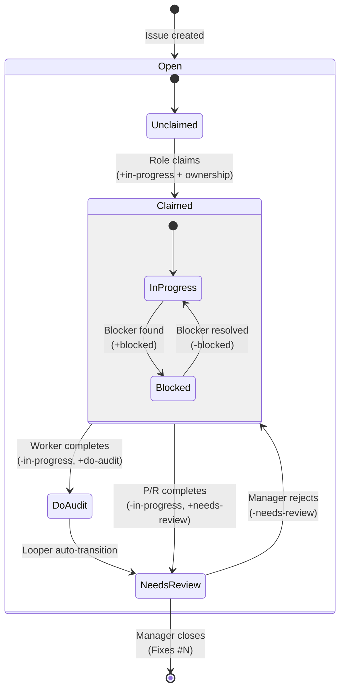

# diagrams/issue-workflow.md

Issue Workflow State Machine

**Issue:** #1054
**Author:** Researcher
**Pinned to commit:** 43d693b
**Date:** 2026-01-29

---

## Issue Lifecycle

## State Descriptions

| State | Labels | Description |
|-------|--------|-------------|
| **Unclaimed** | (none) | Open issue, no owner |
| **Claimed** | `in-progress` + ownership label | Owned by role instance |
| **Blocked** | `in-progress` + ownership label + `blocked` | Work paused on blocker |
| **DoAudit** | `do-audit` | Worker done, awaiting Prover audit |
| **NeedsReview** | `needs-review` | Ready for Manager review |
| **Closed** | (closed state) | Manager verified and closed |

## Role Transitions

| Transition | Who | Action |
|------------|-----|--------|
| Claim | Any role | `gh issue edit N --add-label in-progress --add-label <ownership>` (ownership: W1-W5/prov1-prov3/R1-R3/M1-M3) |
| Block | Any role | `gh issue edit N --add-label blocked` |
| Unblock | Any role | `gh issue edit N --remove-label blocked` |
| Complete (Worker) | Worker | `gh issue edit N --add-label do-audit --remove-label in-progress` (keep ownership W<N>) |
| Complete (Other) | P/R/M | `gh issue edit N --add-label needs-review --remove-label in-progress` (keep ownership label) |
| Auto-promote | Looper | `do-audit` → `needs-review` (automatic) |
| Close | Manager | Commit with `Fixes #N`, then close |
| Reject | Manager | Remove `needs-review`, comment on issue |

## Special Cases

### Multi-Worker Mode

When multiple workers exist (`AI_WORKER_ID` set), claims use orthogonal labels: `in-progress` + `W1`, `in-progress` + `W2`, etc.
The ownership label (W1, W2) is kept through the workflow (do-audit, needs-review) for attribution.
Each worker can only claim/release their own ownership label.

### Duplicate/Environmental Issues

Manager can close without `Fixes #N` if labeled:
- `duplicate` - Issue duplicates another
- `environmental` - Resolved by environment setup, not code

### Tracking Issues

Issues labeled `tracking` are excluded from Worker queue. These are known limitations
that can't be fixed (external dependencies, data quality). Manager reviews periodically.

## Anti-patterns

| Wrong | Right |
|-------|-------|
| Worker uses `Fixes #N` | Worker uses `Part of #N` + `do-audit` |
| Skip do-audit step | Always go through audit |
| Leave in-progress after done | Remove in-progress when adding do-audit/needs-review |
| Close without Fixes commit | Manager creates Fixes commit first (unless duplicate/environmental) |

## References

- ai_template.md: "Issue Closure Workflow" section
- shared.md: "Issue Workflow" section
- looper.py: Auto-transitions do-audit → needs-review
